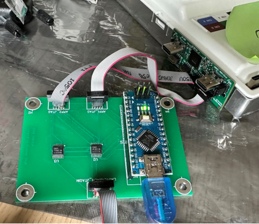
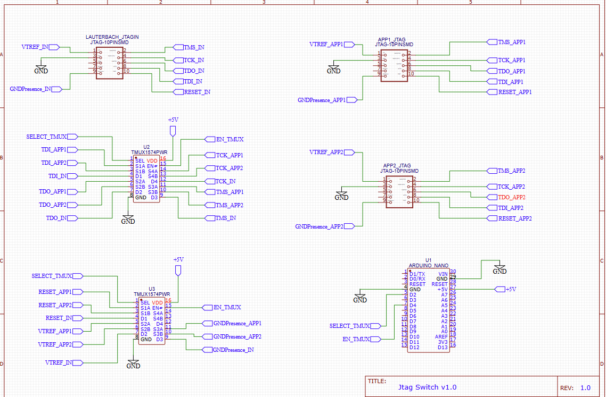
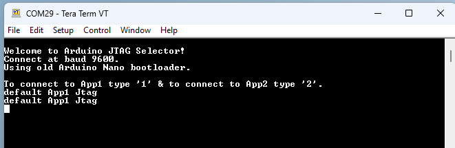

# 🔀 JTAG Selector Switch – Remote Debugging Solution

**Author:** Pradeep Singh  

---

## 📌 Overview

The **JTAG Selector Switch** is a hardware and software solution that enables remote switching between two JTAG interfaces (App1 and App2) on an ECU using a single Lauterbach debugger.

Instead of requiring two debuggers or manually swapping JTAG cables, this tool allows seamless switching via a simple serial console command.

The system consists of:

- Custom PCB hardware
- Arduino Nano controller
- Two TMUX1574 analog switch ICs
- Console-based User Interface (Serial COM)

---

## 🚨 Problem Statement

In earlier Remote HIL setups:

- Two Lauterbach debuggers were required to connect to App1 and App2 JTAGs.
- Lauterbach debuggers are expensive.
- Limited debugger availability across setups.
- Manual presence was required to switch JTAG cables when using a single debugger.

### 💡 Need

A cost-effective and reliable solution to switch between two JTAG interfaces using only one Lauterbach debugger.

---

## ✅ Proposed Solution

Developed a **JTAG Selector Tool** that:

- Enables remote switching between App1 and App2 JTAG
- Uses only one Lauterbach debugger
- Eliminates manual cable reconnection
- Operates through simple serial console commands

---

## 🧩 System Architecture

### 🔹 Hardware Components

#### Arduino Nano
- Receives user commands via USB Serial (COM port)
- Controls selection and enable lines for analog switches

#### TMUX1574 (Texas Instruments)
- 2:1 SPDT quad analog switch
- 4 channels per IC
- Two ICs used to switch up to 8 JTAG-related signals
- Switches signals such as:
  - TMS
  - TCK
  - TDI
  - TDO
  - RESET
  - VTREF
  - GND Presence

#### Custom PCB
- Designed using EasyEDA
- Compact, low-cost, reliable design
- Optimized for JTAG signal routing

---

## 🔌 Hardware Control Mapping

| Signal        | Arduino Pin |
|--------------|------------|
| SELECT_TMUX  | D2         |
| EN_TMUX      | D4         |

- Default state → **App1 JTAG connected**
- Switching handled safely using disable → select → enable sequence

---

## 💻 Software / User Interface

The system uses a **console-based UI** (e.g., TeraTerm).

### Default Behavior

On power-up → Connected to **App1 JTAG**

### Commands

| Command | Action |
|---------|--------|
| `1`     | Switch Lauterbach to App1 |
| `2`     | Switch Lauterbach to App2 |

Switching is:
- Instantaneous
- Reliable
- Safe for JTAG operation

---

## 🔄 Workflow

1. Power ON ECU
2. Connect Arduino Nano via USB
3. Open TeraTerm (or any serial terminal)
4. Select the appropriate COM port
5. Default connection → App1
6. Type:
   - `2` → Switch to App2
   - `1` → Switch back to App1
7. Continue debugging seamlessly using Lauterbach

---

## 💰 Benefits & Impact

### 💶 Cost Savings
Eliminates the need for multiple Lauterbach debuggers  
Approximate savings: **€7000 per setup**

### 🔁 Flexibility
Enables remote debugging setups with a single debugger

### 🧠 Simplicity
Easy switching via console command

### 📈 Scalability
PCB can be replicated easily for multiple test benches

### 🚀 Productivity Boost
- Faster remote debugging
- Reduced hardware constraints
- Eliminated need for manual presence

---

## 📂 Repository Structure
- /hardware : PCB design files (EasyEDA)
- /firmware : Arduino Nano source code
- /images : Hardware setup images
- README.md

---

## ⭐ Final Note

This project demonstrates a practical, low-cost engineering solution to improve remote debugging efficiency in embedded automotive environments.

**Happy Debugging 🙂**